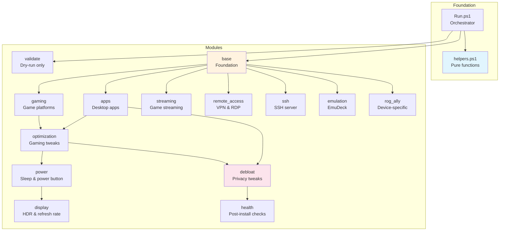

# ROG Ally PowerShell Modules

Bootible uses a modular PowerShell architecture to configure your ROG Ally. Each module handles a specific aspect of the setup.

---

## Module Overview

| Module | Depends On | Description |
|--------|-----------|-------------|
| **validate** | - | Dry-run package validation |
| **base** | - | Hostname, network, winget setup, directory scaffolding |
| **apps** | base | Desktop applications |
| **gaming** | base | Game platforms & launchers |
| **streaming** | base | Game streaming clients |
| **remote_access** | base | VPN, remote desktop, RDP |
| **ssh** | base | SSH server configuration |
| **emulation** | base | EmuDeck setup |
| **rog_ally** | base | Device-specific tools |
| **optimization** | base, gaming | Gaming tweaks |
| **power** | optimization | Sleep/hibernate, power button, CPU boost |
| **display** | power | HDR toggle, refresh rate |
| **debloat** | all | Privacy & performance |
| **health** | all | Post-install health checks |

**All modules are idempotent and safe to re-run.**

---

## Dependency Graph



---

## Load Order

Modules execute in this fixed order:

```
1. helpers.ps1    # Library - always loaded first
2. validate       # Dry-run only - package validation
3. base           # Foundation - hostname, network, winget
4. apps           # Desktop applications
5. gaming         # Game platforms & launchers
6. streaming      # Game streaming clients
7. remote_access  # VPN & remote desktop
8. ssh            # SSH server configuration
9. emulation      # EmuDeck setup
10. rog_ally      # Device-specific tools
11. optimization  # Windows gaming tweaks
12. power         # Sleep-to-hibernate, power button, CPU boost
13. display       # HDR toggle and refresh rate
14. debloat       # Privacy & performance tweaks
15. health        # Post-install health checks
```

**Why this order matters:**

- `base` initializes winget before any package installs
- `apps` installs PowerShell 7 which `ssh` and `debloat` can use
- `optimization` configures Steam settings (requires Steam from `gaming`)
- `debloat` runs after all installs to configure the installed applications
- `health` runs last - read-only checks that verify what the run claims to have done

---

## validate

**Purpose:** Pre-flight validation of all winget package IDs

**Runs:** Dry-run mode only

Validates that all package IDs in the configuration exist in winget sources. Reports which packages are available and which are missing.

**Example Output:**

```
Validating packages...
  ✓ Discord.Discord
  ✓ Spotify.Spotify
  ✗ Invalid.PackageID - Not found in winget
```

---

## base

**Purpose:** System foundation and prerequisites

**Config Keys:**

| Key | Type | Default | Description |
|-----|------|---------|-------------|
| `hostname` | string | `""` | System hostname (empty = keep current) |
| `static_ip.enabled` | bool | `false` | Enable static IP |
| `static_ip.adapter` | string | `"Ethernet"` | Network adapter name (`Get-NetAdapter` to list) |
| `static_ip.address` | string | `""` | IP address |
| `static_ip.prefix_length` | int | `24` | Subnet prefix |
| `static_ip.gateway` | string | `""` | Default gateway |
| `static_ip.dns` | list | - | DNS servers |
| `package_managers.chocolatey` | bool | `true` | Install Chocolatey (winget fallback) |
| `package_managers.scoop` | bool | `false` | Install Scoop |
| `optimize_winget` | bool | `true` | Optimize winget sources (not in `config.yml`; read directly by the module) |
| `games_path` | string | `""` | Games directory to create, e.g. `D:\Games` (empty = skip) |
| `roms_path` | string | `""` | ROMs directory to create, e.g. `D:\Emulation\ROMs` (empty = skip) |

**What It Does:**

1. Sets hostname if specified
2. Configures static IP or DHCP
3. Installs optional package managers (Chocolatey, Scoop)
4. Optimizes winget source updates
5. Installs essential utilities (7-Zip, Everything, PowerToys)
6. Creates `games_path`/`roms_path` directories if configured (drive-letter
   paths only; Steam library registration stays manual — Steam > Settings > Storage)

---

## apps

**Purpose:** Desktop application installation

**Master Key:** `install_apps` (default: `true`)

**Application Categories:**

| Category | Config Keys |
|----------|-------------|
| **Utilities** | `install_7zip`, `install_everything`, `install_powertoys`, `install_windows_terminal`, `install_powershell7` |
| **Communication** | `install_discord`, `install_signal` |
| **Media** | `install_vlc`, `install_spotify` |
| **Browsers** | `install_firefox`, `install_chrome`, `install_edge` |
| **Productivity** | `install_obs`, `install_vscode` |
| **VPN** | `install_tailscale`, `install_protonvpn` |
| **Password Managers** | `password_managers`: list of `1password`, `bitwarden`, `keepassxc` |
| **Development** (master: `install_dev_tools`) | `install_git`, `install_python`, `install_nodejs`, `install_java` |
| **System Utilities** (master: `install_system_utilities`) | `install_revo_uninstaller`, `install_ccleaner`, `install_wiztree`, `install_drivereasy` |
| **Runtimes** (master: `install_runtimes`) | `install_dotnet_runtime`, `install_dotnet_desktop`, `install_vcredist`, `install_directx` |

**Example:**

```yaml
install_apps: true
install_discord: true
install_spotify: true
password_managers:
  - "1password"
install_powershell7: true  # PowerShell 7
```

---

## gaming

**Purpose:** Gaming platforms and utilities

**Master Key:** `install_gaming` (default: `true`)

**Platforms:**

| Key | Package |
|-----|---------|
| `install_steam` | Valve.Steam |
| `install_gog_galaxy` | GOG.Galaxy |
| `install_epic_launcher` | EpicGames.EpicGamesLauncher |
| `install_ea_app` | ElectronicArts.EADesktop |
| `install_ubisoft_connect` | Ubisoft.Connect |
| `install_amazon_games` | Amazon.Games |
| `install_battle_net` | (special handling) |
| `install_playnite` | Playnite.Playnite |
| `install_launchbox` | (manual — prints download link) |
| `install_ds4windows` | Ryochan7.DS4Windows |
| `install_nexus_mods` | NexusMods.Vortex |

**Battle.net Note:**

Battle.net uses a non-standard installer. Bootible downloads and launches it; you complete installation manually. `battle_net_location` (default `%ProgramFiles(x86)%\Battle.net`, not in `config.yml`) overrides where Bootible looks for an existing install.

---

## streaming

**Purpose:** Game streaming clients

**Master Key:** `install_streaming` (default: `true`)

| Key | Package | Use Case |
|-----|---------|----------|
| `install_moonlight` | MoonlightGameStreamingProject.Moonlight | Stream from a PC running Sunshine |
| `install_parsec` | Parsec.Parsec | Low-latency streaming |
| `install_chiaki` | Streetpea.Chiaki-ng | PlayStation Remote Play |
| `install_steam_link` | Valve.SteamLink | Steam streaming |
| `install_greenlight` | (manual — prints download link) | Xbox streaming |
| `install_xbox_app` | Microsoft.GamingApp | Xbox Cloud Gaming |
| `install_geforcenow` | NVIDIA.GeForceNow | Cloud gaming |

!!! note "No Sunshine host on the Ally"
    Bootible installs streaming **clients** on the Ally. Sunshine (the host) belongs on the PC you stream from — install it there manually. See [Game Streaming](../../features/streaming.md).

---

## remote_access

**Purpose:** VPN and remote desktop tools

**Master Key:** `install_remote_access` (default: `false`)

| Key | Default | Description |
|-----|---------|-------------|
| `install_tailscale` | `false` | Mesh VPN |
| `install_anydesk` | `false` | Remote desktop |
| `install_rustdesk` | `false` | Open-source remote desktop |
| `enable_rdp` | `false` | Windows Remote Desktop (not in `config.yml`; read directly by the module) |

**RDP Configuration:**

When `enable_rdp: true`, Bootible:

1. Enables Remote Desktop in the registry (`fDenyTSConnections = 0`)
2. Enables the built-in "Remote Desktop" firewall rule group

---

## ssh

**Purpose:** Windows OpenSSH server configuration

**Master Key:** `install_ssh` (default: `false`)

| Key | Type | Default | Description |
|-----|------|---------|-------------|
| `ssh_server_enable` | bool | `false` | Install & enable OpenSSH Server |
| `ssh_authorized_keys` | list | `[]` | Key files from `private/ssh-keys/` to authorize |

**What It Does:**

1. Installs OpenSSH Client/Server Windows capability
2. Sets sshd and ssh-agent services to automatic start
3. Imports the listed authorized keys from the private repo
4. Configures PSRemoting over SSH (if PowerShell 7 installed)
5. Creates firewall rules for SSH and ICMPv4 (ping)

**Key Import:**

```yaml
ssh_authorized_keys:
  - "desktop.pub"
  - "laptop.pub"
```

Keys are read from `private/ssh-keys/` (or `private/files/ssh-keys/`) and written to `C:\ProgramData\ssh\administrators_authorized_keys` with locked-down ACLs.

!!! note "Key management removed"
    Earlier docs described key *generation* options (`ssh_generate_key`, `ssh_add_to_github`). Those keys were never wired up on Windows and were removed; key management may return as a future feature.

---

## emulation

**Purpose:** EmuDeck installation

**Master Key:** `install_emulation` (default: `false`)

**What It Does:**

1. Checks for existing EmuDeck installation (skips if found)
2. Pre-installs EmuDeck's prerequisites (Git, Python 3.12) via winget
3. Uses the EA (Patreon) installer from `private/scripts/` if available
4. Falls back to the public EmuDeck installer

EmuDeck itself configures emulators **interactively** — finish setup in the EmuDeck app. The `roms_path`/`games_path` keys only scaffold directories (see [base](#base)); they don't configure EmuDeck.

**Patreon Version:**

```
private/scripts/EmuDeck EA Windows.bat
```

---

## rog_ally

**Purpose:** ASUS ROG Ally-specific tools

**Master Key:** `install_rog_ally` (default: `true`)

| Key | Package | Description |
|-----|---------|-------------|
| `install_armoury_crate` | - | Verify Armoury Crate presence |
| `install_myasus` | - | ASUS support app |
| `install_handheld_companion` | BenjaminLSR.HandheldCompanion | Alternative controller mapper |
| `install_rtss` | Guru3D.RTSS | Frame limiter & OSD |
| `install_hwinfo` | REALiX.HWiNFO | Hardware monitoring |
| `install_msi_afterburner` | Guru3D.Afterburner | GPU tweaking (limited on Ally) |
| `install_ghelper` | (GitHub release) | Lightweight Armoury Crate alternative |
| `install_hidhide` | Nefarius.HidHide | Hide physical gamepad from games (reboot required after first install) |
| `install_cpuz` | CPUID.CPU-Z | CPU information |
| `install_gpuz` | TechPowerUp.GPU-Z | GPU information |

**Armoury Crate:**

Bootible verifies Armoury Crate is present (usually pre-installed) but doesn't modify it.

---

## optimization

**Purpose:** Windows gaming optimizations

**Master Key:** `install_optimization` (default: `true`)

| Key | Type | Default | Description |
|-----|------|---------|-------------|
| `enable_game_mode` | bool | `true` | Windows Game Mode |
| `enable_hardware_gpu_scheduling` | bool | `true` | HAGS (AMD frame generation needs this ON) |
| `disable_game_dvr` | bool | `true` | Disable Game DVR |
| `disable_xbox_game_bar` | bool | `false` | Disable Xbox Game Bar |
| `disable_tips` | bool | `true` | Windows tips and suggestions |
| `disable_core_isolation` | bool | `false` | Disable Memory Integrity (security trade-off) |
| `disable_vm_platform` | bool | `false` | Disable Virtual Machine Platform (security trade-off) |
| `disable_bitlocker` | bool | `false` | Disable BitLocker (restart required) |
| `disable_amd_varibright` | bool | `true` | Disable AMD Vari-Bright |
| `configure_power_plans` | bool | `true` | Windows power plans |
| `steam_disable_guide_focus` | bool | `true` | Stop Xbox button opening Steam overlay |
| `steam_start_big_picture` | bool | `true` | Start Steam in Big Picture mode |
| `enable_storage_sense` | bool | `true` | Auto-cleanup temporary files |
| `run_disk_cleanup` | bool | `false` | Run Windows Disk Cleanup |
| `force_time_sync` | bool | `true` | Force NTP time sync |
| `generate_battery_report` | bool | `false` | Battery health report on Desktop |

**Security Trade-offs:**

!!! warning "Core Isolation & VM Platform"
    Disabling Core Isolation or the Virtual Machine Platform can improve gaming performance but reduces security. Only disable if you understand the implications.

---

## power

**Purpose:** Sleep-to-hibernate conversion and power-button behavior via `powercfg`

| Key | Type | Default | Description |
|-----|------|---------|-------------|
| `sleep_mode` | string | `"default"` | `hibernate` maps idle sleep to hibernate (Modern Standby drains 10-23% battery in 12h on Ally-class devices) |
| `hibernate_after_minutes` | int | `0` | Hibernate timeout when `sleep_mode: hibernate` (`0` = system default) |
| `power_button_action` | string | `""` | `sleep`, `hibernate`, or `shutdown` (`""` = unchanged) |
| `disable_cpu_boost_on_battery` | bool | `false` | Disables CPU boost on the battery (DC) power setting only |

All keys default to off - the module changes nothing unless you opt in.

!!! info "What it can't control"
    Firmware-level Modern Standby behavior (S0 wake sources) is not controllable from Windows. This module changes what Windows does on idle, lid, and power-button events.

---

## display

**Purpose:** HDR toggle and refresh rate for the internal panel

| Key | Type | Default | Description |
|-----|------|---------|-------------|
| `configure_hdr` | string | `""` | `""` (leave alone), `on`, or `off` — **not** a bool |
| `set_refresh_rate` | int | `0` | Target Hz, e.g. `60` or `120` (`0` = leave alone) |

Both keys default to "leave alone" — the module changes nothing unless you opt in.

**HDR:** uses `HDRCmd` from the [HDRTray](https://github.com/res2k/HDRTray) project, downloaded automatically on first use and cached locally. It handles the Windows 11 24H2 Auto Color Management edge case where the built-in toggle may not fully activate HDR.

**Refresh rate:** only panel-supported modes are applied. An unsupported rate is skipped with a warning listing the available rates.

---

## debloat

**Purpose:** Privacy and performance tweaks

**Master Key:** `install_debloat` (default: `true`)

### Privacy Settings

| Key | Default | Description |
|-----|---------|-------------|
| `disable_telemetry` | `true` | Windows telemetry |
| `disable_activity_history` | `true` | Activity tracking |
| `disable_location_tracking` | `true` | Location services |
| `disable_copilot` | `true` | Microsoft Copilot |

### UI Settings

| Key | Default | Description |
|-----|---------|-------------|
| `classic_right_click_menu` | `true` | Win11 classic context menu |
| `show_file_extensions` | `true` | Show extensions |
| `show_hidden_files` | `false` | Show hidden files in Explorer |
| `disable_lockscreen_junk` | `true` | Lock screen tips, ads, spotlight |
| `disable_bing_search` | `true` | Bing in Start menu |
| `clean_desktop_shortcuts` | `true` | Remove desktop shortcuts after setup |
| `disable_fullscreen_optimizations` | `false` | Disable fullscreen optimizations |

### Edge Debloating

| Key | Default | Description |
|-----|---------|-------------|
| `debloat_edge` | `true` | Remove Edge bloat/telemetry |
| `disable_edge` | `true` | Disable Edge completely (use with caution) |

### Network & Performance

| Key | Default | Description |
|-----|---------|-------------|
| `prefer_ipv4` | `true` | IPv4 over IPv6 |
| `disable_teredo` | `true` | Teredo tunneling |
| `set_services_manual` | `true` | Non-essential services to manual |

### PowerShell

| Key | Default | Description |
|-----|---------|-------------|
| `powershell7_default_terminal` | `true` | Make PS7 the default terminal |
| `disable_powershell7_telemetry` | `true` | Disable PS7 telemetry |

### Personalization

| Key | Default | Description |
|-----|---------|-------------|
| `wallpaper_path` | `""` | Custom wallpaper image |
| `wallpaper_style` | `"Fill"` | Fill, Fit, Stretch, Center, Tile, Span |
| `lockscreen_path` | `""` | Custom lock screen |

**Image Paths:**

Reference images from your private repo:

```yaml
wallpaper_path: "Images/wallpaper.jpg"
lockscreen_path: "Images/lockscreen.jpg"
```

Images are copied from `private/device/rog-ally/<device>/Images/`.

---

## health

**Purpose:** Post-install health checks

**Master Key:** `post_install_health_checks` (default: `true`)

Read-only checks that verify what the run claims to have done — e.g. Game Mode and HAGS registry state, SSH server state (`ssh_server_enable`), RDP (`enable_rdp`), time sync (`force_time_sync`), and presence of key installs (Steam, Git, PowerShell 7). Runs last and changes nothing.

---

## Selective Module Execution

### Run Specific Modules

```powershell
cd $env:USERPROFILE\bootible\config\rog-ally

# Only base and apps
.\Run.ps1 -Tags base,apps

# Only gaming-related
.\Run.ps1 -Tags gaming,streaming,emulation

# Dry run specific modules
.\Run.ps1 -Tags optimization,debloat -DryRun
```

### Skipping Modules

There is no skip flag. To skip a module, either pass `-Tags` listing every module you *do* want, or disable the module in config (see below).

### Dependencies Not Auto-Included

Running `-Tags apps` without `base` may fail if winget sources aren't initialized. Include dependencies manually.

---

## Disabling Modules

Disable modules via configuration:

```yaml
install_apps: false
install_gaming: false
install_streaming: false
install_remote_access: false
install_ssh: false
install_emulation: false
install_rog_ally: false
install_optimization: false
install_debloat: false
```

---

## Re-run Behavior

### Always Safe

- Package installs (winget skips installed)
- Registry settings (same value = no change)
- Service configuration (checks state first)
- Firewall rules (checks existing rules)

### Minor Effects on Re-run

- **Wallpaper/lock screen**: Re-copies images
- **Desktop shortcuts**: Re-cleans desktop
- **UCPD scheduled task**: Re-creates task

### Checks Before Acting

- **Hostname**: Only changes if different
- **Static IP**: Only if not configured
- **EmuDeck**: Only if not detected
- **OpenSSH**: Only if capability not present

---

## Troubleshooting

### Module Didn't Run

1. Check if enabled: `install_<module>: true`
2. Check `-Tags` includes module
3. Review transcript log for skip messages

### Package Install Failed

1. Run dry-run to validate: `.\Run.ps1 -DryRun`
2. Check winget: `winget source list`
3. Reset: `winget source reset --force`

### Registry Changes Not Applied

1. Some HKCU keys need non-elevated context
2. `debloat` creates scheduled task for UCPD keys
3. Log out/in to apply scheduled changes

### SSH Not Working

1. Check service: `Get-Service sshd`
2. Check firewall: `Get-NetFirewallRule -DisplayName "*SSH*"`
3. Check keys: `C:\ProgramData\ssh\administrators_authorized_keys`
