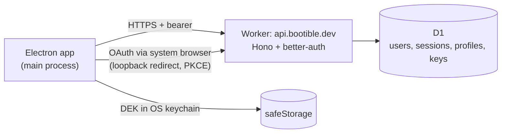

# Cloud Accounts & Profile Sync — Design

## Context

Make bootible profiles follow the user across machines, optionally, without the server ever reading their secrets. Enables the flows in `flows/account-and-keys.md` and `flows/profile-sync.md`; evaluated against `north-star.md`; grounded in `findings.md` (notably: DPAPI secrets are machine-bound, so a portable, client-held key is mandatory).

## Constraints

- **All-Cloudflare**, better-auth + D1 (owner decision). Free-tier-friendly.
- **E2E secrets**: the server stores only wrapped key material and opaque ciphertext.
- **Optional + offline-first**: every existing flow works signed-out and with no network.
- **Desktop client is Electron** (not a browser) — auth must work for a native app.
- v1 scope: account + profile sync only. No sharing/library.

## Design

### Topology

A new **`packages/api`** Cloudflare Worker (Hono router + better-auth) bound to a **D1** database, deployed to `api.bootible.dev` on the dedicated Cloudflare account. The static site (`packages/site`) stays on Cloudflare Pages at `bootible.dev`. The Electron app talks to the Worker over HTTPS with a session bearer token.



### Authentication for a native app

OAuth uses the **native-app pattern (RFC 8252)**: the Electron main opens the **system browser** to the Worker's better-auth authorize URL with **PKCE** and a `http://127.0.0.1:<random-port>/callback` redirect served by a short-lived loopback listener in the main process. better-auth completes the provider handshake and redirects to the loopback with a session; the app captures it and closes the listener. Email+password and passkeys run in an in-app modal `BrowserWindow` pointed at the Worker's hosted auth page (passkeys need a real origin — `api.bootible.dev`). The resulting **session token is stored in the OS keychain** via Electron `safeStorage` (machine-local cache is fine; it is not synced).

### End-to-end secret encryption

Identity (better-auth) and secret-access (the data key) are **separate**. Server is zero-knowledge of secrets.

| Element | What it is | Where it lives |
|--------|------------|----------------|
| **DEK** | random 32-byte key; AES-256-GCM encrypts profile secrets | plaintext only client-side (OS keychain); never sent |
| **KEK** | `Argon2id(sync-passphrase, salt)` → 32 bytes | derived client-side on demand, never stored |
| **wrapped_dek_passphrase** | `AES-256-GCM(KEK, DEK)` | D1 (server can't unwrap) |
| **recovery code** | 128-bit, shown once, base32 | user keeps it; never sent |
| **wrapped_dek_recovery** | DEK wrapped by a key derived from the recovery code | D1 |
| **secrets_enc** (per profile) | `AES-256-GCM(DEK, JSON(secrets))` | D1, opaque |

Argon2id runs **client-side** (wasm in the Electron main) so the passphrase never leaves the device. This **replaces** the DPAPI `secretsEnc` for synced profiles; local-only (signed-out) profiles keep the existing DPAPI path. The non-secret `ui` is stored as plain JSON server-side (it's selections, not credentials) — see Trade-offs.

### Data model (D1)

better-auth owns `user`, `session`, `account`, `verification`. App tables:

```
profile(
  id TEXT PK, account_id TEXT, name TEXT, device_id TEXT, base_id TEXT,
  ui_json TEXT,            -- non-secret selections, plaintext JSON
  secrets_enc TEXT,        -- E2E ciphertext (or NULL if no secrets)
  version INTEGER,         -- bumped on each local edit
  updated_at INTEGER,
  deleted INTEGER DEFAULT 0  -- tombstone
)  -- unique(account_id, id)

account_keys(
  account_id TEXT PK, kdf TEXT, kdf_salt TEXT,
  wrapped_dek_passphrase TEXT, wrapped_dek_recovery TEXT, updated_at INTEGER
)
```

### API (external contract)

All under `api.bootible.dev`, authed by the better-auth session except `/api/auth/*`.

| Method | Path | Purpose |
|--------|------|---------|
| `*` | `/api/auth/*` | better-auth (providers, callback, session) |
| GET | `/api/keys` | fetch wrapped DEK material (or 404 = none set) |
| PUT | `/api/keys` | store/replace wrapped DEK material |
| GET | `/api/profiles` | list `{id,name,version,updated_at,deleted}` |
| GET | `/api/profiles/:id` | full `{name,device_id,base_id,ui,secrets_enc,version,updated_at}` |
| PUT | `/api/profiles/:id` | upsert (body carries client `version`+`updated_at`) |
| DELETE | `/api/profiles/:id` | tombstone |
| DELETE | `/api/account` | wipe profiles + keys + account |

The server is a **dumb versioned store** — it does not merge. Merge/conflict logic is client-side (below), keeping the Worker simple.

### Sync engine (Electron main)

A `CloudClient` module + IPCs (`cloud:status|signIn|signOut|setupKey|unlock|syncNow`). The renderer's existing profile save/load calls fan out to it when signed in.

- **Save/Update** → bump `version`, encrypt secrets with DEK, `PUT /profiles/:id`; queue if offline.
- **Open (signed in)** → `GET /profiles`, then per profile reconcile against the local copy and a stored **`lastSyncedVersion`**:
  - cloud-only → add; locally-newer → keep + upload; cloud-newer & local unchanged → replace.
  - **both changed since lastSynced → keep both** (`"<name> (conflict — <device>)"`).
- **Delete** → tombstone locally + `DELETE`; apply incoming tombstones on pull.
- Profiles whose `secrets_enc` can't be decrypted (DEK not unlocked here) appear with secrets gated behind "unlock"; non-secret build still works.

### Cross-cutting concerns

- **Optionality**: the `CloudClient` is dormant until sign-in; no code path requires it. Signed-out = today's behaviour exactly.
- **Offline**: all sync calls are best-effort with a local queue; failures never block local save/build.
- **Secret model unification**: when signed in, secrets use the DEK; signing out reverts new saves to DPAPI. One adapter chooses the cipher by auth state, containing the choice in one place.

## Trade-offs

- **`ui` stored plaintext server-side** (not E2E) — it's app/emulator/removal *selections*, not credentials; keeping it queryable/debuggable is worth more than encrypting non-secrets. Only `secrets_enc` is E2E. (Revisit if any future `ui` field becomes sensitive.)
- **Dumb store + client merge** instead of server CRDT — far simpler Worker; "keep both" guarantees no data loss at the cost of occasional manual reconciliation.
- **Separate sync passphrase** — unavoidable friction for true E2E across mixed providers; set once, re-entered only on new devices.
- **Argon2 wasm** adds client bundle weight — accepted; required for client-side KDF.

## Alternatives Considered

- **Supabase / Clerk / Auth0** — rejected; all-Cloudflare keeps one account, one bill, one mental model.
- **Server-side secret encryption** — rejected; server could read secrets, violating the north star.
- **Sync the DPAPI `secretsEnc` as-is** — impossible; DPAPI is machine-bound (findings).
- **KV instead of D1** — rejected for the relational profile/version/account queries; D1 fits.
- **Custom-protocol (`bootible://`) OAuth redirect** — viable, but loopback (RFC 8252) is more robust across OSes and AV; passkeys still need the hosted origin regardless.
- **Passkey PRF-derived key** (no passphrase for passkey users) — attractive, but uneven browser/authenticator support; left as a later enhancement on top of the universal passphrase.

## Risks and Mitigations

- **better-auth on Workers/D1 maturity** → use its official D1 adapter, pin versions, smoke-test the providers early.
- **Argon2 in Electron main** → use a maintained wasm/native binding; tune params for ~0.5–1s on desktop.
- **Passphrase + recovery both lost** → by design secrets are then unrecoverable; the UI states this before setup and non-secret sync is unaffected.
- **Token/keychain on shared PCs** → sign-out clears the session and DEK from the machine; document it.
- **CF account not yet provisioned** → the entire Worker/D1 build is gated on it; client crypto + sync-engine scaffolding can be built and unit-tested against a local `wrangler dev` + local D1 first.
