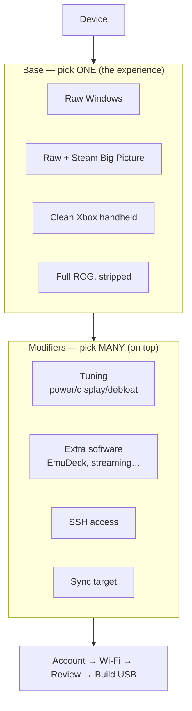
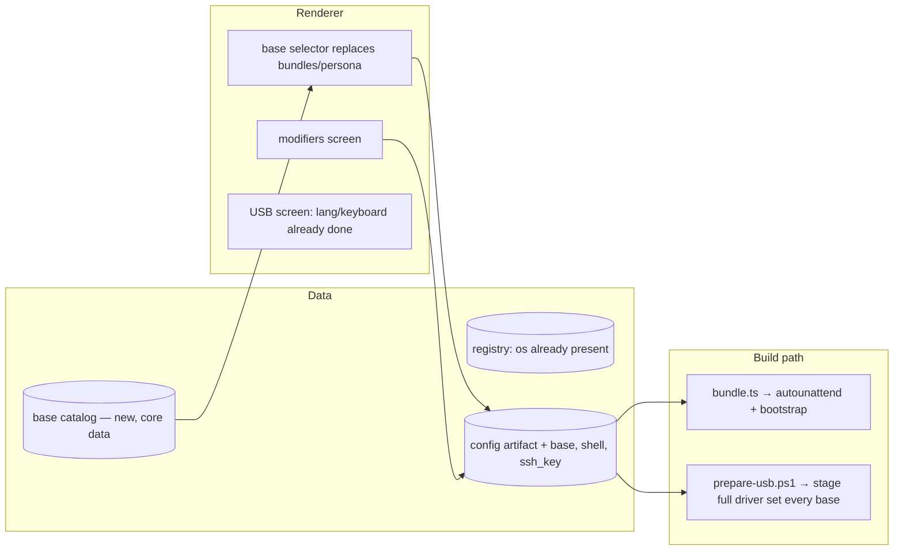

# bootible — Base Layer Design

**Status:** Design (ODAD step 4). **DRAFT for review.**
**Builds on:** `findings-base-layer.md`, `north-star.md`, `design.md` · **Followed by:** plans (per base + per module)

> Markers: **▶ Rec** = my recommendation, proceed unless you object. **❓ Decide** = a genuine fork needing your call. This design adds a layer to the existing v2 architecture; it does not replace any locked contract.

---

## 1. Context

A bootibled Ally installs clean Windows and boots to the desktop. The factory device boots into the Xbox shell with full ASUS hardware control. The user's goal: let people **choose the experience their handheld boots into**, then customise it.

`findings-base-layer.md` established the enabling facts: the Xbox shell is now an OS feature (Win11 24H2+, registry-automatable), ASUS *function* comes from stageable drivers (separable from Armoury Crate the app), and these layers stack with bootible's tuning without conflict.

This design introduces one new concept — the **base** — and one dimension the config has never modelled: **boot shell** (what auto-launches). Full hardware drivers become a universal floor (staged for every base), not a per-base choice.

### North-star declarations (agreed)

The base concept added four declarations to `north-star.md` (group: *Choose your experience*) — agreed, and the anchor for everything below: the user picks the boot experience up front; "clean Xbox" = functional hardware with no ASUS software; every base is debloated+tuned by default (better than factory); modifiers layer on any base.

---

## 2. The model: base × modifiers

A **base** resolves to two things: a **shell** (boot target) and a **software floor** (modules it pre-installs). Modifiers are the existing module catalog, layered on top. A base is a more capable `Bundle` — it adds the shell dimension a bundle never had.

**Drivers are not a base dimension — they are a universal floor.** Every base stages the **full driver set** so all hardware works (CPU/chipset, USB, Wi-Fi, Bluetooth, AMD GPU, and the ASUS System Control Interface / MCU for back buttons, TDP, fan, brightness). The bases differ *only* in shell + pre-installed software; hardware is always 100% functional.

**Decided:** the base selector **replaces** the `bundles`/`persona` screen. Everyone picks a base (the "set it up for me" outcome is now "pick a base"), then optionally opens modifiers (the tinker screen). This collapses two screens into one clearer choice; the persona fork is retired.

### The new dimension (one, not two)

| Dimension | Values | How it's applied |
|-----------|--------|------------------|
| **Boot shell** | `desktop` · `steam-bigpicture` · `xbox` | Registry + startup config on-device (bootstrap) |

Drivers are a **universal floor**, not a per-base dimension: `prepare-usb.ps1` always stages the full driver set (`asus-drivers` is applied to every base, like Wi-Fi already is).

### The four bases

Bases differ **only** in shell + pre-installed software. Hardware (full driver set) and tuning are constants on all four.

| Base | Shell | Software floor | Notes |
|------|-------|----------------|-------|
| **Raw Windows** | `desktop` | — | Clean, tuned Windows desktop. A PC you hold. |
| **Raw + Steam Big Picture** | `steam-bigpicture` | `steam` | Boots into Steam Big Picture. No ASUS app, no Xbox. |
| **Clean Xbox handheld** | `xbox` | `xbox-fullscreen` | Xbox shell, **no ASUS software** (Xbox app is the shell). |
| **Full ROG, stripped** | `xbox` | `armoury-crate`, `xbox-fullscreen` | Xbox shell + Armoury Crate SE, debloated + tuned. |

**Universal floor (every base):** full driver set (`asus-drivers`) + tuning (`power`, `display`, `windows-defaults`, `optimization`) + the user's app/SSH modifier picks. "All hardware works, debloated and tuned" is true for all four — only the shell and pre-installed software change.

---

## 3. New modules

Four modules, each fitting the existing `BootibleModule` contract (`apply(ctx, exec)` + `check()`), so the orchestrator, bootstrap generator, and on-device executor need no new machinery.

### `xbox-fullscreen` (easy — registry + winget)
Installs the Xbox home app (`Microsoft.GamingApp` ▶ Rec via winget) and enables Xbox mode with enter-on-startup via registry. **Contained complexity:** exact keys are isolated in this one module; the rest of the system only sees "a module."
**Gap:** registry keys to confirm on-device (`findings-base-layer.md` stub).

### `asus-drivers` (medium — smaller than first thought) — **universal floor**
A4 research reframed this. Windows Update already covers AMD GPU, MediaTek Wi-Fi (staged) + Bluetooth, audio, chipset on a clean install — the validated run proved it. The **only** ASUS-specific, clean-install-missing driver is the **ASUS System Control Interface** (back/Option buttons, Command Center button, ACPI/brightness). And ASUS publishes **no static driver URLs** (API-gated).
So this module is:
1. **Trigger a Windows Update driver scan** at first logon (network is up) to pull the bulk.
2. **Ensure the System Control Interface** — if Windows Update doesn't deliver it, stage that *one* driver (resolved from the ASUS API at build time, or captured once + version-checked).
**Applied to every base** so all hardware works on all four.
**Open:** whether Windows Update delivers the SCI driver itself (Phase C) — decides one-driver vs zero. Reboot may be needed (like HidHide).

### `armoury-crate` (medium — vendor installer, Full ROG only)
A4 research resolved the silent-install question: **there isn't a reliable one** — the installer is GUI (`SetupROGLSLService.exe`) and known to hang. But Windows **auto-prompts** to install Armoury Crate on first boot once the ASUS components are present. So for Full ROG, **lean on the OS auto-prompt** (or stage `SetupROGLSLService.exe` and first-run it), not a forced silent install. Only the Full ROG base includes this.

### `ssh-key` (easy — feature + file)
Enables the OpenSSH Server optional feature and writes the user's **pasted public key** to `authorized_keys`.
**Contained complexity:** public keys are not secrets — they live in the config artifact as plain data (unlike Wi-Fi/storage creds, which stay in the keystore per north-star). One user-input field, no secret-provider involvement.

---

## 4. Where it touches the existing system

| Layer | Change | Risk |
|-------|--------|------|
| **Core data** | New `bases.ts` catalog (id, label, shell, moduleFloor) — data, like `platforms.ts`. | Low |
| **Config artifact** | Add `base`, `shell`, `ssh_key` fields. Additive; old configs default to `raw`/`desktop`. | Low — schema-versioned |
| **Modules** | 4 new modules + a `shell` applier in the bootstrap. | Med — `asus-drivers` is the weight |
| **prepare-usb.ps1** | `Resolve-Driver` → resolve a *list*; stage the full driver set for **every** base. | **High** — vendor URLs, ordering, reboots |
| **Renderer** | Base selector replaces bundles/persona; surfaces module floor; SSH key field. | Med — reuses card pattern |

**Cross-cutting:** the **shell** is applied on-device by the bootstrap (registry + startup), *not* by the autounattend — it depends on apps (Steam/Xbox) being installed first, which happens at first logon. So shell application is the **last** bootstrap step, after installs. This ordering is the one real sequencing constraint.

---

## 5. Trade-offs

- **Base replaces bundles** → one fewer concept, but throws away the just-built bundles/persona screen. ▶ Rec accept: base is strictly more capable, and the screens are young.
- **Driver staging at build time** → a build now depends on reaching ASUS's servers (like it already depends on Fido/MS for the ISO). Accepted: same shape as today's ISO dependency; cache + browse-local fallback applies.
- **Tuning on by default for all bases** → "Raw Windows" is **clean + tuned** (decided), not vanilla. It still gets bootible's power/display/debloat floor; "raw" refers to the *shell* (desktop, no launcher), not the absence of tuning. Consistent with "every base is better than factory."

---

## 6. Alternatives considered

- **Base as just another bundle** — rejected: bundles can't express shell or driver staging; bolting those onto `Bundle` pollutes a clean contract. A distinct `base` concept contains the new dimensions.
- **Install Armoury Crate and let its Update Center fetch drivers** (skip `asus-drivers` staging) — rejected as the *default* path: it needs network at first logon and a working Armoury Crate, and gives "Clean Xbox" no way to get drivers without the app. Staging is more robust and serves the no-ASUS-software base. Could remain a fallback.
- **Ship the Xbox shell via the autounattend** — rejected: the shell depends on the Xbox app existing, which isn't true until first-logon installs run. Must be a late bootstrap step.

---

## 7. Risks and mitigations

| Risk | Mitigation |
|------|------------|
| ASUS driver URLs/versions drift | Fetch at build time from the support page; never hardcode. Cache + browse-local fallback. |
| Armoury Crate has no clean silent install | Verify first; fallback to staged-installer + first-run, or a `guided` hand-off step. |
| Xbox-mode registry keys change across builds | Isolate in `xbox-fullscreen`; confirm on-device; treat as the volatile surface. |
| Driver/AC need reboots mid-bootstrap | Sequence shell-apply last; use the existing reboot-aware pattern (HidHide already needs one). |
| Any base ships without working buttons/TDP/fan | `asus-drivers` is a **universal floor** applied to every base (like Wi-Fi) — never optional. |

---

## 8. Build order (for the plans that follow)

1. **`xbox-fullscreen` + `shell` applier** — fully automatable, validates the shell dimension end-to-end on the next Ally run. Lowest risk, highest signal.
2. **`ssh-key`** — small, independent, high user value.
3. **Base catalog + config fields + renderer base selector** — wires the model together; bases selectable, shells working, on the existing Wi-Fi-only driver floor.
4. **`asus-drivers` staging (the full set)** — the hard part, and now **foundational**: it's what makes "all hardware works" true for *every* base. Capture the RC72LA driver set first (close the findings stubs), then extend `prepare-usb.ps1` staging to the list.
5. **`armoury-crate`** — last, pending the silent-install verification.

Steps 1–3 ship the model and the shells on the current Wi-Fi driver floor (a device that boots right but isn't yet fully hardware-complete). Step 4 is the upgrade that delivers the "all hardware works" promise across all four bases — higher priority than a per-base toggle would have been, since now every base depends on it. Keeping it after 1–3 still lets the model prove out while the driver set is captured, so a snag in staging doesn't block the shells.
