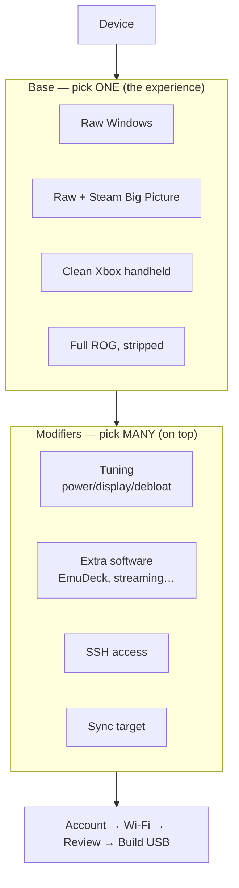
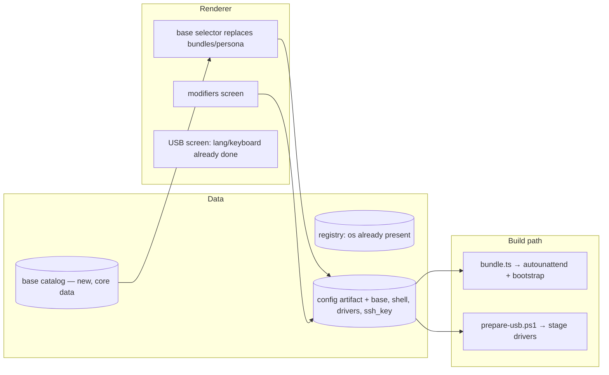

# bootible — Base Layer Design

**Status:** Design (ODAD step 4). **DRAFT for review.**
**Builds on:** `findings-base-layer.md`, `north-star.md`, `design.md` · **Followed by:** plans (per base + per module)

> Markers: **▶ Rec** = my recommendation, proceed unless you object. **❓ Decide** = a genuine fork needing your call. This design adds a layer to the existing v2 architecture; it does not replace any locked contract.

---

## 1. Context

A bootibled Ally installs clean Windows and boots to the desktop. The factory device boots into the Xbox shell with full ASUS hardware control. The user's goal: let people **choose the experience their handheld boots into**, then customise it.

`findings-base-layer.md` established the enabling facts: the Xbox shell is now an OS feature (Win11 24H2+, registry-automatable), ASUS *function* comes from stageable drivers (separable from Armoury Crate the app), and these layers stack with bootible's tuning without conflict.

This design introduces one new concept — the **base** — and two dimensions the config has never modelled: **boot shell** (what auto-launches) and **driver stack** (what gets staged beyond Wi-Fi).

### North-star declarations (agreed)

The base concept added four declarations to `north-star.md` (group: *Choose your experience*) — agreed, and the anchor for everything below: the user picks the boot experience up front; "clean Xbox" = functional hardware with no ASUS software; every base is debloated+tuned by default (better than factory); modifiers layer on any base.

---

## 2. The model: base × modifiers

A **base** resolves to three things: a **shell** (boot target), a **driver stack** (what to stage), and a **module floor** (modules it implies). Modifiers are the existing module catalog, layered on top. A base is a strictly more capable `Bundle` — it adds the shell and driver dimensions a bundle never had.

**Decided:** the base selector **replaces** the `bundles`/`persona` screen. Everyone picks a base (the "set it up for me" outcome is now "pick a base"), then optionally opens modifiers (the tinker screen). This collapses two screens into one clearer choice; the persona fork is retired.

### The two new dimensions

| Dimension | Values | How it's applied |
|-----------|--------|------------------|
| **Boot shell** | `desktop` · `steam-bigpicture` · `xbox` | Registry + startup config on-device (bootstrap) |
| **Driver stack** | `wifi` (always) · `+asus` | Staged onto the USB by `prepare-usb.ps1` |

### The four bases

| Base | Shell | Driver stack | Module floor | Notes |
|------|-------|--------------|--------------|-------|
| **Raw Windows** | `desktop` | wifi | — | Today's behaviour. |
| **Raw + Steam Big Picture** | `steam-bigpicture` | wifi | `steam` | Steam installed, launched into Big Picture on login. |
| **Clean Xbox handheld** | `xbox` | wifi **+asus** | `asus-drivers`, `xbox-fullscreen` | Fully functional hardware, **no ASUS app**. |
| **Full ROG, stripped** | `xbox` | wifi **+asus** | `asus-drivers`, `armoury-crate`, `xbox-fullscreen` | Factory function + Xbox shell, debloated + tuned. |

Every base also gets the user's tuning/app/SSH modifier picks. Tuning (`power`, `display`, `windows-defaults`, `optimization`) is **on by default** for all bases — "debloated and tuned" is the floor, per the north-star delta.

---

## 3. New modules

Four modules, each fitting the existing `BootibleModule` contract (`apply(ctx, exec)` + `check()`), so the orchestrator, bootstrap generator, and on-device executor need no new machinery.

### `xbox-fullscreen` (easy — registry + winget)
Installs the Xbox home app (`Microsoft.GamingApp` ▶ Rec via winget) and enables Xbox mode with enter-on-startup via registry. **Contained complexity:** exact keys are isolated in this one module; the rest of the system only sees "a module."
**Gap:** registry keys to confirm on-device (`findings-base-layer.md` stub).

### `asus-drivers` (hard — staging, no winget)
Stages the ASUS driver set (System Control Interface, MCU, AMD GPU) onto the USB, consumed during install like the MT7922 Wi-Fi driver.
**Contained complexity:** this is the one genuinely hard piece. Contain it in `prepare-usb.ps1`'s existing `Resolve-Driver`/staging path, extended to a *list* of drivers fetched at build time.
**Gaps:** exact driver URLs for RC72LA, version pinning, reboot ordering — all build-time-fetched, never hardcoded.

### `armoury-crate` (medium — vendor installer)
Installs Armoury Crate SE silently.
**Gap:** confirm a silent-install flag that doesn't drag the wider ASUS suite. **❓ Decide** fallback if no clean silent install exists: stage the installer + first-run it, or hand off (a `guided`-style step).

### `ssh-key` (easy — feature + file)
Enables the OpenSSH Server optional feature and writes the user's **pasted public key** to `authorized_keys`.
**Contained complexity:** public keys are not secrets — they live in the config artifact as plain data (unlike Wi-Fi/storage creds, which stay in the keystore per north-star). One user-input field, no secret-provider involvement.

---

## 4. Where it touches the existing system

| Layer | Change | Risk |
|-------|--------|------|
| **Core data** | New `bases.ts` catalog (id, label, shell, driverStack, moduleFloor) — data, like `platforms.ts`. | Low |
| **Config artifact** | Add `base`, `shell`, `drivers`, `ssh_key` fields. Additive; old configs default to `raw`/`desktop`/`wifi`. | Low — schema-versioned |
| **Modules** | 4 new modules + a `shell` applier in the bootstrap. | Med — `asus-drivers` is the weight |
| **prepare-usb.ps1** | `Resolve-Driver` → resolve a *list*; stage ASUS set when `drivers=+asus`. | **High** — vendor URLs, ordering, reboots |
| **Renderer** | Base selector replaces bundles/persona; surfaces module floor; SSH key field. | Med — reuses card pattern |

**Cross-cutting:** the **shell** is applied on-device by the bootstrap (registry + startup), *not* by the autounattend — it depends on apps (Steam/Xbox) being installed first, which happens at first logon. So shell application is the **last** bootstrap step, after installs. This ordering is the one real sequencing constraint.

---

## 5. Trade-offs

- **Base replaces bundles** → one fewer concept, but throws away the just-built bundles/persona screen. ▶ Rec accept: base is strictly more capable, and the screens are young.
- **Driver staging at build time** → a build now depends on reaching ASUS's servers (like it already depends on Fido/MS for the ISO). Accepted: same shape as today's ISO dependency; cache + browse-local fallback applies.
- **Tuning on by default for all bases** → "Raw Windows" is **clean + tuned** (decided), not vanilla. It still gets bootible's power/display/debloat floor; "raw" refers to the *shell* (desktop, no launcher), not the absence of tuning. Consistent with "every base is better than factory."

---

## 6. Alternatives considered

- **Base as just another bundle** — rejected: bundles can't express shell or driver staging; bolting those onto `Bundle` pollutes a clean contract. A distinct `base` concept contains the new dimensions.
- **Install Armoury Crate and let its Update Center fetch drivers** (skip `asus-drivers` staging) — rejected as the *default* path: it needs network at first logon and a working Armoury Crate, and gives "Clean Xbox" no way to get drivers without the app. Staging is more robust and serves the no-ASUS-software base. Could remain a fallback.
- **Ship the Xbox shell via the autounattend** — rejected: the shell depends on the Xbox app existing, which isn't true until first-logon installs run. Must be a late bootstrap step.

---

## 7. Risks and mitigations

| Risk | Mitigation |
|------|------------|
| ASUS driver URLs/versions drift | Fetch at build time from the support page; never hardcode. Cache + browse-local fallback. |
| Armoury Crate has no clean silent install | Verify first; fallback to staged-installer + first-run, or a `guided` hand-off step. |
| Xbox-mode registry keys change across builds | Isolate in `xbox-fullscreen`; confirm on-device; treat as the volatile surface. |
| Driver/AC need reboots mid-bootstrap | Sequence shell-apply last; use the existing reboot-aware pattern (HidHide already needs one). |
| "Clean Xbox" ships without working buttons | `asus-drivers` is a **hard dependency** of the xbox/rog bases — enforce in the base's module floor, not optional. |

---

## 8. Build order (for the plans that follow)

1. **`xbox-fullscreen` + `shell` applier** — fully automatable, validates the shell dimension end-to-end on the next Ally run. Lowest risk, highest signal.
2. **`ssh-key`** — small, independent, high user value.
3. **Base catalog + config fields + renderer base selector** — wires the model together; bases selectable even before drivers exist.
4. **`asus-drivers` staging** — the hard part; do it once the rest proves the model. Unblocks Clean Xbox + Full ROG.
5. **`armoury-crate`** — last, pending the silent-install verification.

This sequences the easy, high-signal wins first and quarantines the one hard problem (driver staging) until the model around it is proven — so a failure there doesn't block everything else.
