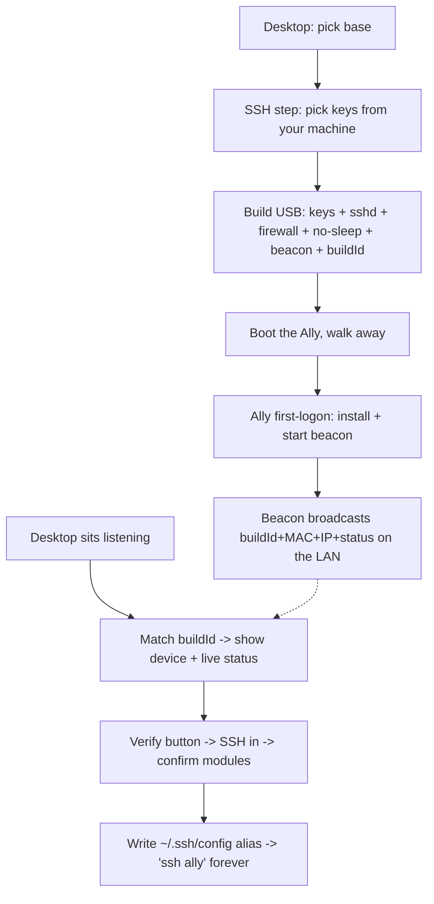

# Headless Remote Provisioning — Design

**Status:** Design (ODAD step 4). **DRAFT for review.**
**Builds on:** `design-base-layer.md`, the `ssh-key` module (Phase A2) · **Followed by:** plans

> Markers: **▶ Rec** = recommendation. **❓ Decide** = a fork needing a call.

---

## 1. Context

Setting up a handheld by hand is miserable: a keyboard jammed into it, the screen read through a phone camera, no mouse, fighting Windows sleep/firewall, hunting the device's IP. bootible already moved the *build* to the desktop — but everything *after* boot (verify, diagnose, fix) drags you back onto the device.

This design closes that gap. The goal isn't "the device configures itself." It's:

> **The handheld is born headless. You never touch it again — no keyboard, mouse, or screen. Everything from your desk, ending in `ssh <name>` with nothing else typed.**

### North-star declarations (proposed — group: *Never touch the handheld*)

- A user provisions and verifies a handheld **without ever attaching a keyboard, mouse, or reading its screen** — every interaction is from their desktop.
- A freshly-built device **announces itself on the network**; the desktop **discovers it, shows live status, and verifies it over SSH** — no IP hunting.
- A user authorises SSH access by **picking from the keys already on their machine** (multi-select), not by pasting key text.
- After provisioning, the user reaches the device with **`ssh <name>` — no username, password, IP, or key path** (bootible writes the SSH alias for them).
- None of this **requires an account, a cloud service, or Tailscale** — the default path is pure LAN. Those are opt-in upgrades for cross-network reach.

> **❓ Decide:** approve these (or amend) — they anchor the design.

---

## 2. The loop



Eight steps, zero on-device interaction: **pick keys → build → walk away → watch it appear → it self-verifies → `ssh ally`.**

---

## 3. Components

### 3.1 Host SSH integration (replaces the paste-a-key field)
bootible inspects the **desktop** (the machine it's running on):
- **OpenSSH client present?** (needed to SSH in later — inbox on Win11, usually). If not, offer to add it.
- **Keys present?** Enumerate `~/.ssh/*.pub` (and optionally `ssh-add -L` agent keys). Show them in a **multi-select** — the user ticks which public keys to authorise on the device.
- **No keys?** Offer to generate one (`ssh-keygen -t ed25519`).
- **Fallback:** a "paste a key" option for a key that lives on another machine.

Reading `~/.ssh/*.pub` is safe — public keys aren't secrets, private keys are never touched. (Verified feasible: the dev desktop already has `id_rsa.pub`, `authorized_keys.txt`, etc.)

### 3.2 Build payload additions
The USB build gains, beyond the base bundle:
- The **selected public keys** → `%ProgramData%\ssh\administrators_authorized_keys` (admin account) with the locked ACL (the existing `ssh-key` module logic).
- **OpenSSH Server via winget** (`Microsoft.OpenSSH.Preview`) — *not* the DISM/FoD path, which can stall (learned the hard way). ▶ Rec: switch the `ssh-key` module to winget.
- **Firewall rule** opening TCP 22 inbound.
- **No-sleep on AC** (already shipped in the power module).
- A **user-set hostname** → the autounattend `<ComputerName>` (field already exists). It drives the beacon's `hostname`, the `<hostname>.local` mDNS name, and the SSH alias (`Host <hostname>`). Validate to Windows rules (≤15 chars, alphanumeric + hyphen, no spaces). Default suggested from the device + a short build suffix.
- **Optional static IP** (see §3.7) — intended IP/mask/gateway/DNS, baked in; the beacon confirms it.
- A **beacon agent** (a small startup script).
- A **buildId** — a random token generated at build time, baked into the USB, known to the desktop.

### 3.3 Beacon protocol
The beacon agent runs at first logon (startup task) and broadcasts a small UDP datagram on the LAN every few seconds:

| Field | Purpose |
|-------|---------|
| `buildId` | The token the desktop baked — proves "this is the device *I* built", not just *a* bootible device |
| `mac` | Stable device handle across reboots/IP changes (user's explicit ask) |
| `ip` | Current address, for the SSH connection |
| `hostname` | For the `.local` alias |
| `status` | `installing` / `configuring` / `done` (+ optional progress) — drives the desktop's live view |

▶ Rec: UDP broadcast to the subnet on a fixed bootible port — dead simple to emit (a few lines of PowerShell) and to listen for (a UDP socket in the Electron main process). mDNS (`_bootible._tcp.local`) is a nicer-but-heavier alternative; the `.local` *hostname* (for the SSH alias) we get for free from Windows' built-in mDNS regardless.

### 3.4 Desktop listener + discovery
While the user waits, bootible opens a UDP listener and shows a "waiting for your device" screen. On a datagram whose `buildId` matches the one it baked: show the device, its live `status`, and a **Verify** button. (bootible adds its own inbound firewall rule for the listener on first run.)

### 3.5 Verify
**Verify** → bootible SSHes in with the selected key (no prompts) → runs read-only checks (modules applied? Steam installed? restore points? `bootstrap.log` tail) → shows a green/amber report. The "did it actually work" step, from the desktop.

### 3.6 Frictionless SSH alias (the "no username/password" guarantee)
On successful verify, bootible writes a **managed block** into the desktop's `~/.ssh/config`, keyed on the user-set hostname:

```
# >>> bootible managed: vengeance-ally >>>
Host vengeance-ally
  HostName <static IP if set+confirmed, else vengeance-ally.local>
  User <account bootible created>
  IdentityFile ~/.ssh/<selected key>
  IdentitiesOnly yes
  StrictHostKeyChecking accept-new
# <<< bootible managed: vengeance-ally <<<
```

Then **`ssh vengeance-ally`** needs no username, password, IP, or key path. `HostName` resolution, most-stable first: a **confirmed static IP** (§3.7) → the device's **`.local` mDNS name** (survives DHCP changes) → the **beacon-tracked IP** as a last resort. The block is delimited and idempotent — bootible only ever touches its own section, never the user's existing hosts.

### 3.7 Optional static IP, beacon-confirmed
The user may set a static IP at build time (bootible pre-fills mask/gateway/DNS from the desktop's own network). It's baked in and applied at first logon (`Set-NetIPAddress`/`netsh` on the Wi-Fi adapter). The **beacon still broadcasts the device's *actual* IP**, which makes the static IP self-verifying:

- **beacon IP == intended** → static IP applied. ✓
- **beacon IP != intended** → it fell back to DHCP; the static config didn't take. Because the beacon reported the *real* address, bootible can **SSH in via that address and re-apply** (or surface it for one click). A bad static IP therefore **cannot strand the device** — the beacon is always the ground truth for where it actually is.

This is the general pattern: the beacon reports *actual* state, bootible reconciles against *intended* state. For now it reconciles IP; the same channel could verify more later. **❓ Decide:** IP-conflict avoidance (suggest an address outside the DHCP pool) is best-effort — the beacon + reconcile is the real safety net, so we can keep the picker simple and let the loop catch problems.

### 3.8 Remote access — three clearly-labelled options
Once the device is reachable (§3.6), *how* you get in is the user's choice. The discovery / alias / static-IP plumbing serves all three; they differ only in what's installed and the edition.

| Method | Gives you | Edition | Reach |
|--------|-----------|---------|-------|
| **SSH** | Terminal | any | `ssh <hostname>` (always set up) |
| **Remote Desktop (RDP)** | Full Windows GUI | **Pro only** | `mstsc <hostname>` — an *enable Remote Desktop* toggle that **appears only when the user picked Pro** (edition picker; Home default) |
| **Streaming (Sunshine ↔ Moonlight)** | Live screen + controller/KB/mouse | any (incl. Home) | bidirectional — see below |

**Streaming pair — install both on both, label them by role.** Sunshine and Moonlight are two halves of one link, and which box is which depends on direction. To keep it flexible *and* avoid making newcomers reason about it, bootible offers **both apps on the ROG** *and* **both apps on the host** (the desktop it runs on — it winget-installs locally, check-then-install). Either direction then works with no reconfig:
- **Play your PC games on the handheld:** host = **Sunshine (server)**, handheld = **Moonlight (client)**.
- **See/control the handheld from your desk:** handheld = **Sunshine (server)**, desk = **Moonlight (client)** — the GUI-on-Home answer when RDP isn't available.

**Labelling is a build requirement, not a nicety.** Everywhere these appear:
- **Sunshine — streaming *server*** (shares *this* machine's screen).
- **Moonlight — streaming *client*** (view *another* machine here).

This extends the device `streaming` module (currently Moonlight + Chiaki) to also install **Sunshine** on the ROG, and adds a **host-side install** step (Sunshine + Moonlight on the desktop, check-then-install) — the same host-integration pattern as the SSH key-picker (§3.1).

---

## 4. Cross-network fallbacks (opt-in, nobody required to have them)
LAN broadcast and mDNS only cross the **same subnet/VLAN**. Default is the LAN beacon (works for the common case — same home network). For reaching a device on a different network:
- **bootible.dev phone-home** — the beacon also POSTs to a bootible.dev endpoint; the desktop subscribes. Needs the (unbuilt) backend + an account. Privacy: sends MAC/IP to a server.
- **Tailscale** — bootible joins the device to the user's tailnet at first boot; reachable by name anywhere. Zero-config for those who already run it.

Beacon-first; these are upgrades, never prerequisites.

---

## 5. Constraints & caveats (honest)

| Constraint | Handling |
|-----------|----------|
| Broadcast/mDNS = same subnet only | Default for the common case; Tailscale/cloud for cross-network. State it in the UI ("waiting on this network"). |
| Desktop must be *listening* when the device comes up | The "waiting for your device" screen *is* the listener; it can also catch a device that boots later. |
| Desktop firewall for the UDP listener | bootible adds its own inbound rule (one-time, needs elevation). |
| Host-key trust on first connect | `accept-new` in the alias; optionally capture the host key during verify and pin it to `known_hosts`. |
| Editing `~/.ssh/config` safely | Delimited bootible-managed block, idempotent; never clobber the user's existing entries. |
| sshd FoD install can stall | Use winget OpenSSH, not DISM/FoD (learned on hardware). |
| A bad static IP could strand the device | It can't — the beacon always broadcasts the *real* IP, so a failed static config is detected and re-applied over SSH (§3.7). |
| Hostname validity | Validate to Windows rules (≤15 chars, alphanumeric + hyphen) before baking into `<ComputerName>`. |

---

## 6. Trade-offs & alternatives

- **Beacon vs cloud-first** — beacon (LAN) chosen as default: no account, no backend, no privacy export, works offline. Cloud is the opt-in for cross-network.
- **MAC as identity vs a pure buildId** — using *both*: buildId proves "my build", MAC is the durable handle the user asked for. (A buildId alone would also work and avoids broadcasting the hardware MAC, but the user wants MAC-based identity and it's already LAN-visible via ARP.)
- **Pick-from-your-keys vs paste** — picking is the default (the keys are already on the machine); paste stays as a fallback for off-machine keys.

---

## 7. Build order

1. **`ssh-key` → winget OpenSSH + firewall** — harden the existing module (kills the FoD-stall class of failure). Small, immediate.
2. **Host SSH key-picker UI** — detect client/keys, multi-select, generate-if-none, paste fallback. Replaces the paste field.
3. **Beacon agent + buildId** (device side) + **desktop UDP listener + waiting screen**.
4. **Verify step** — SSH in, run checks, report.
5. **SSH config alias writer** — keyed on the user-set **hostname**; the `ssh <name>` payoff. (Hostname build-field rides along here — it sets `<ComputerName>` and the alias.)
6. **Optional static IP, beacon-confirmed** — the build field, first-logon apply, and the beacon-reconcile/self-heal loop (§3.7).
7. **Remote-access methods** (§3.8) — edition picker (Home default / Pro); RDP enable-toggle gated on Pro; extend the device `streaming` module to add Sunshine; host-side install of Sunshine + Moonlight (check-then-install); server/client labelling throughout.
8. **(Later)** cross-network fallbacks (Tailscale join; bootible.dev phone-home when the backend exists).

Steps 1–2 stand alone and improve the current build immediately. 3–5 are the discovery+verify loop (with the hostname). 6 layers static-IP on top. 7 is the choose-how-you-reach-it layer. 8 is opt-in reach.
