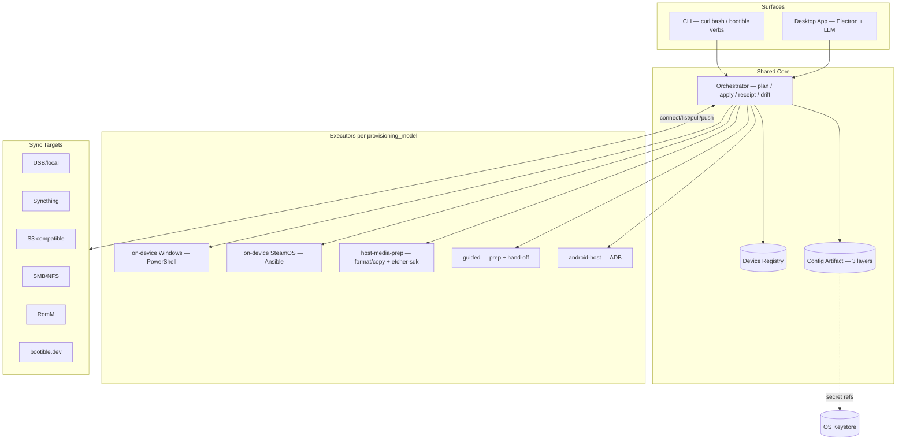

# bootible v2 — Design

**Status:** Design (ODAD step 4 — the architecture that makes the flows real). **DRAFT for review.**
**Builds on:** `findings.md`, `north-star.md`, `flows/` · **Followed by:** `plan.md`

> Reviewer note: recommendations are marked **▶ Rec**; genuine forks needing Gavin's decision are marked **❓ Decide**. Detail is deep for phases 1–3 (Foundation, Retro, Sync) and lighter for phase 4 (App, site), which has unresolved forks and is furthest out.

---

## 1. Architecture at a glance

Three stable contracts (data) sit between the **surfaces** people touch and the **executors** that do platform-specific work:

- **Device Registry** — *what a device is* (data).
- **Config Artifact** — *what you want* (data, 3 layers).
- **Sync-Target interface** — *where your stuff lives* (a uniform port).



**The split that makes it work:**
- The **contracts are language-agnostic**; the **executors stay native** to their platform.
- That split is what lets v1's tested PowerShell/Ansible keep working while host-side and new devices get added around them.

---

## 2. The Device Registry

**Principle:** A device is **data**, not code. Adding Anbernic/Retroid/Miyoo/Analogue/AYN = adding a registry entry.

```yaml
# registry/devices/trimui-brick.yml
id: trimui-brick
name: "TrimUI Brick / Brick Hammer"
provisioning_models: [host-media-prep]      # may list several; user/registry picks
media: { kind: microsd, fs: fat32 }
firmware:                                    # the "OS choice", per host-media-prep
  default: nextui
  options:
    nextui:   { method: extract, source: github:trimui/nextui,   pin: "<tag>", verify: sha256 }
    crossmix: { method: extract, source: github:cizia64/CrossMix, pin: "<tag>", verify: sha256 }
    knulli:   { method: image,   source: github:knulli/knulli,    pin: "<tag>", verify: sha256 }
layout: { dirs: [ROMS, BIOS, SAVES, themes] }   # folder scaffold to lay down
capabilities:                                   # drives capability-aware sync [cap]
  great: [nes, snes, genesis, gb, gbc, gba, pce, neogeo, arcade, ps1]
  varies: [n64, dreamcast, psp]
  none:  [gamecube, ps2, wii, "3ds", switch]
guide: null                                     # host-media-prep needs no exploit guide
questions: []                                   # device-specific branch points (see PSP)
```

**Per-model extensions to the base entry:**
- **`guided` devices** add a `guide:` URL and `questions:` (e.g. PSP board-revision → cIPL vs Infinity).
- **`android-host` devices** add a `connection:` block (host/port/transport — exactly today's `config/android/config.yml`).
- **`on-device` devices** reference their executor module set instead of `firmware:`.

**▶ Rec:** registry entries are YAML files in-repo, schema-validated, with tool versions **pinned + checksummed** and a CI job that flags upstream releases (so "re-verify at build time" is automated, not manual). This directly answers Findings §2's "versions are volatile."

### ✓ Decided — Schemas are first-class

**Decision:** Publish a **JSON Schema** for every YAML shape (registry entries *and* the config artifact in §3) and put a `# yaml-language-server: $schema=https://raw.githubusercontent.com/<repo>/<ref>/schemas/<name>.schema.json` header at the top of each file — the home-ops pattern.

**Rationale:** One schema gives **live in-editor validation** *and* CI validation with no drift between them.

> Gavin — schemas are first-class.

---

## 3. The Config Artifact (3 layers)

```
.bootible/
  config.yml        # LAYER 1 — declarative, portable, hand-editable, schema-versioned
  targets.yml       # the manifest: which sync-target(s) hold saves/content + their roles
  # LAYER 2 (secrets) lives in the OS keystore, referenced by name from config/targets
  # LAYER 3 (durable data: saves/BIOS) lives on the sync-target, never in here
```

**Layer 1 — declarative config** (`config.yml`):
- The merge of today's per-device toggles, now **device-instance scoped** and **schema-versioned** (`schema: 2`) so we can migrate.
- Kilobytes. This is the thing that **travels, diffs, and lives in a bootible.dev account**.

**Layer 2 — secrets** `[secret]`:
- Wi-Fi passwords, target credentials, LLM keys.
- **Referenced from config by name** (`wifi_password: secret://home-wifi`); never written to the artifact, never synced, never hosted.

**Layer 3 — durable data** `[carry]`:
- Saves, BIOS.
- **Not in the artifact** — on the sync-target, addressed via `targets.yml`.

**The restore primitive:** Read `targets.yml` → connect → pull Layer 1 + Layer 3 → re-enter Layer 2 secrets as needed. **One artifact, one primitive.**

**▶ Rec:** one `.bootible/` bundle per device-instance; a user with three devices has three, and a target can hold many. Power users keep the bundle in git if they like (it's just files); the bundle never *requires* git.

### ✓ Decided — D5: Artifact unit is per-device-instance

**Decision:** One `.bootible/` bundle **per device-instance**. Matches today's `private/device/<device>/<instance>/`; a user with three devices has three `.bootible/` bundles, and a target can hold many.

**Rationale:** Direct continuity with the v1 layout; each `config.yml` carries the `# yaml-language-server: $schema=…` header (§2) so it validates live in any editor.

> Gavin — D5: per-device-instance.

### ✓ Decided — Pluggable secret providers

**Decision:** OS keystore (default — Windows Credential Manager / libsecret / macOS Keychain) **+ 1Password CLI (`op`) + Bitwarden CLI (`bw`)** for power users who already keep secrets in a manager.

**Rationale:** Provider is chosen per secret-ref or globally; bootible shells out to the chosen CLI to resolve at apply time, so **secrets are never persisted by bootible itself**.

> Gavin — pluggable secret providers.

---

## 4. The Sync-Target interface

**One port, six (and counting) implementations:**

```
interface SyncTarget {
  connect(creds)            // creds from keystore [secret]
  list(scope)               // what's here (for selective pull)
  pull(scope, dest)         // config, saves, or capability-filtered content
  push(scope, src)          // config, saves
  capabilities()            // selective-list? continuous? content-aware (RomM)?
}
```

| Backend | Notes |
|---|---|
| **local/USB** | the zero-infra floor; `pull/push` = file copy |
| **S3-compatible** | one impl covers R2 / B2 / Wasabi / MinIO |
| **SMB / NFS** | the NAS crowd; mount + copy |
| **RomM** | content-aware: `list` returns platforms/collections → richest capability-aware selection. **❓ verify its API supports selective pull** (Findings §6.2) |
| **bootible.dev** | managed, **config-only** (Layer 1); the free-tier account target |
| **Syncthing** | see below |

**Roles:**
- Assigned **per target** in `targets.yml` (config here, saves there, content from a third) — so "config in my git, saves in S3" works.

**Capability-aware selection** `[cap]`:
- For content `pull`, the orchestrator **intersects** what the target *has* (`list`) with what the device *can run* (registry `capabilities.great`/`varies`) → **a TrimUI never drags PS2 across**.

### ✓ Decided — D3: Syncthing is a transport *under* roles, not a backend we build

**Decision:** bootible points at a local folder; Syncthing invisibly mirrors that folder to the user's other devices, and **the user decides what flows through it** (saves, ROMs, themes — their choice, if they use Syncthing at all). We document Syncthing as a recommended companion (like RomM); **we never reimplement it**.

**Rationale:** It's the simplest mental model *and* the best answer for the non-technical player — "saves just sync, always, no buttons."

**Companion corollary (RomM):** If the user runs a RomM server, **lean on RomM's own sync logic** rather than duplicating it — RomM becomes both the content-aware target *and* the sync engine.

> Gavin — D3: transport-under-roles; user picks what to sync; use RomM's own sync if present.

### ❓ Open — D6: RomM selective-pull API

**Status:** ❓ **D6 still stands** — verify RomM's API supports the selective pull we want **before we depend on it** for content-aware selection (Findings §6.2).

---

## 5. The Core + Executors (and the v1 refactor)

### 5.1 The split

**Orchestrator (shared core):**
- Loads registry + artifact, resolves the provisioning model, **plans** the actions, drives the right executor, collects the **receipt** and **drift** baseline.
- **Stateless w.r.t. platform.**

**Executors (native):**
- `on-device Windows` = the existing **PowerShell** modules.
- `on-device SteamOS` = the existing **Ansible** roles.
- `host-media-prep` = a **cross-platform media engine** (format/copy + `etcher-sdk` for image-flash).
- `guided` = **prep + hand-off**.
- `android-host` = the existing **ADB** stack.

### 5.2 The Phase-1 refactor (pay the debt Findings §1.6 found)

**Why:** To let modules consume the shared artifact and run under an orchestrator (on-device *or* host-driven), the v1 coupling must go.

- **Unify `Get-ConfigValue`** on the pure 3-param `lib/helpers.ps1` version; delete the implicit `$Script:Config` variant.
- **Collapse the two schema validators** into one table (the registry/artifact schema is the single source).
- **Inject config into modules** instead of dot-sourced globals — modules become `f($Config, $Context)`, testable and location-independent.

**Load-bearing:** This refactor *is* the Config Foundation's backbone — it's not optional cleanup, it's what makes everything else composable.

### 5.3 The core runtime strategy (the biggest fork)

**The question:** Where does the orchestrator + host-side + new-device logic actually run? Three options were on the table:

- **(R1) Native executors + a thin orchestrator, shared artifact as the contract.** Windows stays PowerShell, Deck stays Ansible; host-media-prep + the App get a new cross-platform runtime (Node/TS, shared with the app). Least rewrite, leverages tested code; cost = more than one runtime to maintain.
- **(R2) Unify everything on one cross-platform core** (Go/Rust/Node), porting the PS/Ansible logic. Cleanest long-term; cost = a large rewrite of working v1 code — fights "don't break what works."
- **(R3) Hybrid:** shared TS core for orchestration + host-side + new devices; keep PowerShell/Ansible as on-device executors *invoked by* the core via the artifact contract; port opportunistically over time.

#### ✓ Decided — D1: R2 (unify on one cross-platform core)

**Decision:** Port the v1 PowerShell modules + Ansible roles into a single core; **one runtime end-to-end**.

**Rationale:** Cleanest long-term.

**Cost/risk:** R2 rewrites the bulk of v1's *working, green* code. The Plan sequences it as a **strangler-fig** — stand up the core, then port device-by-device (Ally first, then Deck), keeping v1 runnable until each device is re-proven — rather than a big-bang rewrite that regresses reliability.

#### ✓ Decided — D1b: Stack A (TS/Node core + Electron)

**Decision:** R2 forces one language; Gavin chose **TypeScript end-to-end** (§6.2).

**How to apply:** The on-device CLI ships as a **compiled single-file binary of the same core** (not Electron), so handhelds never get Chromium.

> Gavin — D1: R2; D1b: Stack A.

---

## 6. Surfaces

### 6.1 CLI (tinkerer-leaning, always standalone)

- `curl | bash` bootstrap (reuse the v1 worker + integrity layer unchanged) → `bootible <verb>` (`provision`, `restore`, `tweak`, `connect`, `doctor`, `<device>`).
- Reads/writes the **same artifact + registry**.
- **Never needs the app or the site.**

### 6.2 Desktop App (player-leaning, both can use it)

**Role:** The LLM-assisted surface and the friendly face over host-media-prep. Embeds the shared core.

**LLM layer:**
- Guided setup, troubleshooting (feed logs/drift/health), natural-language→config (emit/patch Layer-1 config).
- SSO to a provider account **or** BYO API key (key in keystore).
- **▶ Rec:** default to the latest Claude models; provider-pluggable.

**The stack fork (D1b/D2 — core language + app framework, one coupled choice):** Gavin picked R2 (one core) and flagged "Electron only if resource-efficient" — and Electron is precisely the *least* resource-efficient option, so those two pull against each other. Three coherent stacks were considered:

- **Stack A — TypeScript everywhere:** Node/TS core + **Electron** + `etcher-sdk` + Anthropic TS SDK. Max library fit & velocity; **worst footprint** (Electron) — only viable if we accept/optimize that.
- **Stack B — Rust:** Rust core + **Tauri** + a Rust flasher (or `etcher-sdk` as a Node sidecar) + LLM over HTTP. **Leanest/most efficient**; biggest port effort; thinner LLM/flashing ergonomics.
- **Stack C — Go:** Go core (a **single cross-compiled binary** — ideal for the `curl | bash` CLI and trivial system-tool shelling) + **Wails** webview GUI + a flasher lib/sidecar + LLM SDK/HTTP. Efficient single-binary, excellent CLI distribution; GUI polish below Electron.

#### ✓ Decided — D1b + D2: Stack A (TypeScript everywhere — Node/TS core + Electron)

**Decision:** Stack A. Resolves D1b and D2 together; the bootible.dev site is also TS (§6.3), so **the whole stack is one language**.

**The CLI-on-device concern, resolved:**
- The on-device `bootible` CLI only ever lands on **Deck/Ally** (capable machines — retro/guided/android targets run the CLI on a *host*, never on the handheld).
- It ships as a **standalone compiled binary** of the *same TS core* (Bun or Deno `compile`, or Node SEA) — **not** Electron, so **no Chromium on the handheld** (~50–90 MB single file, no runtime to install).
- The Electron app is a *separate deliverable* that **shares that same core package**.
- **Discipline note:** keep the Electron app lean (it's occasional-use, not always-on) to stay near the ~150–250 MB RAM Gavin is comfortable with.

> Gavin — Stack A (TypeScript everywhere: Node/TS core + Electron).

### 6.3 bootible.dev (phase 4, lighter detail)

- Reuse the existing Worker for entry-script routing + integrity.
- Add a **managed config-only SyncTarget**: an account whose store holds **only** Layer-1 configs (kilobytes → fits Cloudflare free tier on KV/D1).
- "Persist nothing locally" = your config lives here.

#### ✓ Decided — D4: bootible.dev identity is Better Auth

**Decision:** **Better Auth** (`better-auth`, TypeScript) providing **email/password, magic-link, 2FA, and passkey, plus GitHub login**.

**Consequence:** The bootible.dev site is **TypeScript regardless of the core language (D1b)** — the site and the core are separate deployables, so this doesn't constrain the stack choice.

> Gavin — D4: Better Auth + GitHub.

---

## 7. Migration from v1

**The one-time path** for existing Ally/Deck users on the private repo:
- `bootible migrate` reads their `private/device/<device>/<instance>/config.yml` → emits the new `.bootible/` bundle (Layer-1 config + `targets.yml` pointing at, by default, a local folder) and **moves secrets into the keystore**.
- The **private repo becomes a possible *target*, not a requirement**.
- The old `init-private-repo.sh` / device-flow auth / `Select-Config` / log-push paths (Findings §1.3) are **deleted once migration lands**.

---

## 8. Open decisions (consolidated for your review)

| # | Decision | Outcome |
|---|---|---|
| D1 | **Core runtime** (§5.3) | ✓ **R2** — unify on one core, ported strangler-fig (Ally → Deck) |
| **D1b** | **Core language + app framework** (§6.2) | ✓ **Stack A** — TS/Node core + Electron; on-device CLI = compiled single-file binary of the core (no Chromium on handhelds) |
| D2 | App framework (§6.2) | ✓ **Electron** (folded into D1b) |
| D3 | **Syncthing** (§4) | ✓ transport-under-roles; user picks what to sync; use RomM's own sync if present |
| D4 | **bootible.dev identity** (§6.3) | ✓ **Better Auth** (email/pw · magic-link · 2FA · passkey) **+ GitHub** |
| D5 | **Artifact unit** (§3) | ✓ per-device-instance |
| D6 | **RomM selective-pull API** (§4) | ❓ verify before relying on content-aware selection |
| + | **Schemas** (§2) | ✓ JSON Schema + `yaml-language-server` headers (home-ops style) |
| + | **Secrets** (§3) | ✓ pluggable: OS keystore + 1Password CLI + Bitwarden CLI |

---

## 9. How this maps to the build order (preview of the Plan)

1. **Config Foundation** — §2 registry skeleton + §3 artifact + §4 SyncTarget interface (local/USB only) + §5.2 refactor + §7 migration. *Kills the private repo.*
2. **Retro targets** — §5 host-media-prep + guided executors + media engine (§4 etcher-sdk); 3DS → PSP → TrimUI; registry entries (§2).
3. **Sync backends** — the remaining §4 implementations + capability-aware selection; Syncthing/RomM companion docs.
4. **bootible.dev + App** — §6.2 + §6.3.

The detailed, task-level breakdown is `plan.md` (next).
